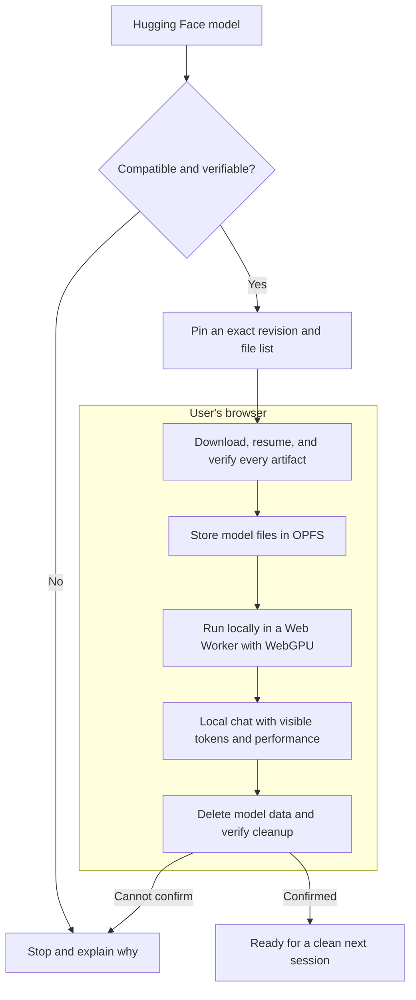

# Glaux

Glaux is an open-source local AI workspace for running compatible Hugging Face ONNX Community text-generation models directly in a browser with WebGPU. Prompts and generated responses stay in the browser; Glaux has no inference server, account system, analytics, or cloud fallback.

Production app: [glaux.rangan39.sh](https://glaux.rangan39.sh)

The application is MIT licensed. Model weights retain the license published by each Hugging Face repository.

## What Glaux is

Glaux is a privacy-first, browser-native model workbench that turns compatible Hugging Face ONNX repositories into locally installed, integrity-checked WebGPU chat runtimes. It presents itself as a focused chat application, but the core of the project is the model lifecycle: discovering a model, deciding whether it can run safely, pinning it to an immutable revision, downloading and verifying its artifacts, storing them locally, and running generation without blocking the interface.

The browser acts as the complete runtime environment. IndexedDB stores catalog and descriptor metadata, the Origin Private File System stores model artifacts, a persistent Web Worker owns tokenization and inference, and WebGPU provides acceleration. Next.js serves the application shell rather than an inference backend.

Glaux is designed around explicit trust boundaries. Model installation requires confirmation; compatibility and integrity checks fail closed; replacement, cancellation, refresh, and partial-download states are handled deliberately; and prompts and responses never leave the browser. Deterministic lifecycle fixtures, browser tests, bundle budgets, dependency audits, and developer telemetry make those guarantees testable rather than aspirational.

## What Glaux does

- Searches the `onnx-community` namespace from the browser and keeps a local searchable catalog in IndexedDB.
- Provides responsive, paginated Popular, Lightweight, and All Models catalog views with browser-side filtering.
- Pins a selected repository to an immutable Hugging Face revision and validates its task, architecture, chat template, graph, file sizes, and integrity metadata before download.
- Downloads ONNX graphs and external tensor data directly into browser-private OPFS storage with resumable checkpoints.
- Runs tokenization and WebGPU inference in a persistent Web Worker through Transformers.js and ONNX Runtime Web.
- Stores one model at a time and confirms replacement before deleting the existing model.
- Treats model storage as session-scoped: departure cleanup is best effort, and every fresh page load performs an authoritative purge and verification before model selection is enabled.
- Opens the selected model’s details as soon as download begins, reports download/loading state in yellow, and turns green only after the runtime is ready.
- Provides model search, pinned Hugging Face model details, deletion controls, and developer inspection views in the sidebar.
- Downloads model files without allocating the inference runtime automatically on mobile; users explicitly load the downloaded model when ready.
- Falls back to an in-app, same-origin browser-storage reset when normal cleanup cannot be verified.
- Reports token timing, TTFT, decode throughput, TPOT, and end-to-end generation latency.
- Supports token- and word-level response inspection in Dev Mode.

## Requirements

- A current Chromium-based browser with WebGPU enabled
- A WebGPU-capable GPU and sufficient system/GPU memory for the selected model
- Enough browser storage for the selected model’s exact confirmed download size
- Node.js 22 for local development

Model compatibility and performance vary by architecture, graph, tokenizer, browser, and hardware. Glaux fails closed when a model cannot satisfy its browser-runtime contract. Community downloads must be public, non-gated ONNX Community text-generation repositories with a chat template, a supported graph, file-size and SHA-256 metadata, and a total selected graph size of at most 8 GiB.

## Run locally

```bash
nvm use
npm ci
npm run dev
```

Open [http://localhost:3000](http://localhost:3000).

Common validation commands:

```bash
npm run check             # lint, type-check, unit tests, and unused-code check
npm run build             # production Next.js build
npm run budget:bundle     # client bundle-size guard
npm run audit:production  # production dependency audit
```

Browser smoke tests expect a running local app. In a second terminal, run `npm run dev` (or start the deterministic fixture server below), then use `npm run smoke:markdown` or set `GLAUX_SMOKE_MODEL` to a saved Hugging Face model ID and run `npm run smoke:prompt`. Run the deterministic lifecycle fixture checks with `npm run smoke:product-ui`, and the Playwright suite with `npm run test:e2e`.

## Browser-only architecture



The design principle is simple: Glaux verifies each step of the model lifecycle and stops instead of guessing when compatibility, integrity, or cleanup cannot be proven.

Next.js serves the application shell only. No repository-owned API receives prompts, responses, model selections, or runtime measurements. Hugging Face and its delivery providers receive ordinary network metadata only when the user searches the public catalog or confirms a model download.

See [docs/architecture.md](docs/architecture.md) for runtime and compatibility details and [docs/security/dependency-audit.md](docs/security/dependency-audit.md) for dependency policy.

## Storage and model delivery

Community model descriptors and catalog metadata are stored in IndexedDB. Model files are streamed into the Origin Private File System. Downloads are pinned to immutable revisions, preflighted against browser quota, and checked against the integrity metadata available from Hugging Face. Glaux keeps one model download at a time; selecting another model removes the previous model’s complete or partial data only after confirmation.

Downloaded model data is intentionally ephemeral. Glaux records an outstanding cleanup obligation before delivery begins, attempts cleanup during page departure, and starts every new visit by exclusively deleting and physically verifying Cache Storage, OPFS model files, IndexedDB checkpoints, and saved model descriptors. Model selection and inference stay disabled until that audit succeeds.

Cleanup stages have bounded deadlines and visible progress. If another tab, a suspended session, or a browser storage operation prevents verification, Glaux fails closed and offers **Reset Glaux storage**. That same-origin endpoint asks the browser to clear the origin’s storage with `Clear-Site-Data`, reloads the application, and repeats the clean-state audit. Browser eviction and the underlying storage implementation remain under browser control.

## Lifecycle test states

Start deterministic development fixtures without downloading a model:

```bash
npm run product:ui
```

Fixture URLs use `?sophon-product-test=<state>`. Available states are `checking`, `legacy-cleanup`, `legacy-cleanup-error`, `cleanup-timeout`, `confirmation`, `replacement-confirmation`, `replacement-deleting`, `downloading`, `paused`, `verifying`, `ready`, `retry-success`, `generating`, `stopped`, `error`, and `reset`. Add `&sophon-product-model=` with one of `hf:fixture-alpha`, `hf:fixture-beta`, `hf:fixture-gamma`, or `hf:fixture-delta` to select a deterministic model fixture.

```bash
npm run smoke:product-ui
```

Fixture mode does not create the inference worker, contact model hosts, or write model bytes.

## Project layout

```text
src/components/glaux-workbench.tsx      Main chat workspace and storage lifecycle
src/components/glaux-model-sidebar.tsx  Catalog, model details, and Dev Mode views
src/lib/model-catalog/                   Browser catalog and immutable descriptors
src/lib/model-delivery/                  OPFS delivery, cleanup, and cache inventory
src/lib/onnx-runner.ts                   Transformers.js pipeline orchestration
src/workers/onnx-worker.ts               Browser download and inference worker
```

The historical lowercase `sophon-*` storage namespaces remain internal compatibility identifiers so existing installations can still find and remove legacy model data. The active design-system namespace is `glaux-*`.

## License

Glaux source code is available under the [MIT License](LICENSE). Model licenses are separate and must be reviewed on the selected Hugging Face repository before use.

## Technical limitations

- **Browser and hardware support is narrow.** Community models use WebGPU only; there is no CPU, WASM, or remote-inference fallback. Glaux targets current Chromium-based browsers, and a compatible model can still fail at load time when the GPU, driver, browser, or available system/GPU memory cannot satisfy its runtime requirements.
- **Repository compatibility is intentionally allowlisted.** Glaux only accepts public, non-gated `onnx-community` repositories for text generation whose architecture is supported by the installed Transformers.js version and whose tokenizer supplies a chat template. It recognizes the graph names `onnx/model_q4f16.onnx`, `onnx/model_q4.onnx`, `onnx/model_fp16.onnx`, and `onnx/model.onnx`, in that preference order; custom layouts and otherwise valid ONNX exports are rejected.
- **Downloads require complete Hub metadata.** The selected graph and every associated external-data file must expose a trustworthy byte size and SHA-256 digest, and their combined size must not exceed 8 GiB. Repositories with more than 2,048 files or graphs referencing more than 256 external-data files are also rejected. Passing these checks establishes Glaux's delivery contract, not that the model will fit on every GPU.
- **Generation is deliberately bounded.** Community models default to at most 128 new tokens, user-supplied generation requests are clamped to 192, and mobile sessions use at most a 2,048-token context with 64 new tokens. Community descriptors do not currently infer a model-specific context limit, so on desktop the tokenizer/runtime remains the final authority; when a known limit is exceeded, older conversation turns are omitted from the active prompt.
- **Only one model is stored at a time.** Installing another model requires deleting the current complete or partial download. On mobile, downloading does not automatically allocate the inference runtime; the user must explicitly load it.
- **Model storage is session-scoped, not a durable offline library.** Departure cleanup is best effort, and every fresh page load purges model files, descriptors, checkpoints, and runtime caches before model selection is enabled. Browser eviction, private-browsing policies, quota changes, another open tab, or a suspended storage operation can interrupt delivery or cleanup and may require the in-app storage reset.
- **Local inference does not mean zero network traffic.** Loading Glaux and searching for or downloading a model requires network access. Hugging Face and its delivery providers receive ordinary request metadata for catalog and artifact requests, although Glaux does not send them prompts or generated responses.
- **The interface is text-chat only.** It does not currently provide multimodal input, embeddings, retrieval, tool calling, fine-tuning, or concurrent model sessions.
